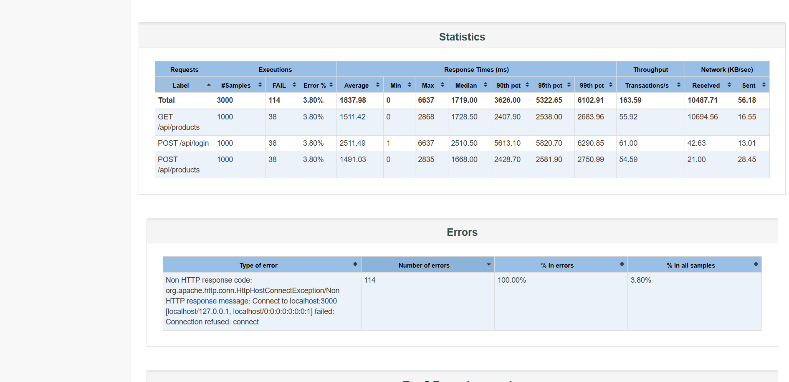

# BÁO CÁO LỖI (BUG REPORTS) — ESHOP SUT

Dưới đây là thông tin chi tiết các lỗi hiệu năng và lỗi hệ thống được phát hiện trong **EShop SUT** thông qua các kịch bản kiểm thử hiệu năng tự động bằng **Apache JMeter** (Load, Stress và Spike Testing).

---

## Danh sách lỗi tổng hợp

| ID Bug | Test Case / Kịch bản phát hiện | Tên lỗi / Mô tả tóm tắt | Mức độ | Trạng thái |
| :--- | :--- | :--- | :---: | :---: |
| **BUG-01** | `23127212_Spike_20260814.jmx` | Server bị sập và từ chối kết nối (`Connection refused`) khi chịu tải Spike vượt quá 520 threads | Critical | Open |

---

## Chi tiết từng Bug

---

### BUG-01: Server bị sập và từ chối kết nối (`Connection refused`) khi chịu tải Spike vượt quá 520 threads

- **ID:** `BUG-PERF-001`
- **Kịch bản phát hiện:** Kịch bản Spike Testing (`23127212_Spike_20260814.jmx`)
- **File log ghi nhận:** `23127212_Spike.jtl`
- **Mức độ nghiêm trọng:** **Critical** — Sập toàn bộ backend dịch vụ, từ chối toàn bộ request đến server từ mọi người dùng.

**Các bước tái hiện:**
1. Khởi động máy chủ backend Node.js của EShop SUT tại địa chỉ `http://localhost:3000`.
2. Mở Apache JMeter và nạp kịch bản `23127212_Spike_20260814.jmx` (Cấu hình: 1000 Virtual Users, Ramp-up 10 giây, Loop: 1).
3. Thực thi kịch bản và theo dõi trạng thái phản hồi qua Listener **View Results Tree** cùng đồ thị kết nối.
**Kết quả mong đợi:**
- Hệ thống duy trì kết nối ổn định hoặc có cơ chế hàng đợi (Rate Limiting/Queue) để xử lý tuần tự.
- Trong trường hợp quá tải, server phải thực hiện Graceful Degradation (trả về mã HTTP `429 Too Many Requests` hoặc `503 Service Unavailable`) thay vì sập socket và ngắt kết nối TCP đột ngột.

**Kết quả thực tế:**
- Khi số lượng active threads trong JMeter đạt mốc **521 threads** (timestamp `1786983144597`), server bị nghẽn Event Loop hoàn toàn và ngắt kết nối.
- Toàn bộ 114 request tiếp theo gửi đến đều bị đánh dấu `success = false` với lỗi kết nối:
  `Non HTTP response code: org.apache.http.conn.HttpHostConnectException`
  `Non HTTP response message: Connect to localhost:3000 [localhost/127.0.0.1, localhost/0:0:0:0:0:0:0:1] failed: Connection refused: connect`
- Báo cáo HTML Dashboard (`HTML_Report_Spike/index.html`) ghi nhận 114 lỗi, chiếm **100% tổng số lỗi** và **3.80% tổng số mẫu request**.

**Ảnh chụp màn hình khi test thất bại:**

