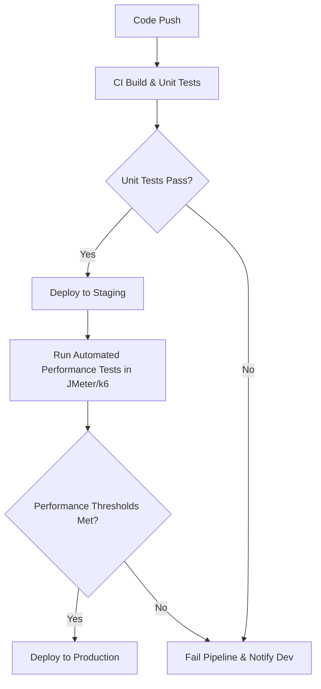

# HW05 - Performance Testing Main Report
**Context:** EShop system (Node.js backend at localhost:3000)

## Task 1: API Endpoint Selection and Scenario Design

### 1. Endpoint Groups
- **Auth-heavy:** `POST /api/login` (Authentication)
- **Read-heavy:** `GET /api/products` (Data retrieval)
- **Transactional:** `POST /api/products` (Data creation/modification)

### 2. Test Scenarios
- **Load Testing (100 VUs):** 
  - Mô phỏng 100 người dùng truy cập đồng thời để đánh giá hành vi hệ thống dưới mức tải dự kiến.
  - Cấu hình: 100 threads, 60s ramp-up.
  - CSV Data Set Config: Dùng cho dữ liệu login và thông tin sản phẩm.
  - Listener: **Summary Report** (cung cấp thống kê tổng quan về request, error rate, throughput, latency).
- **Stress Testing (500 VUs):**
  - Đẩy hệ thống lên mức tải cao hơn để tìm Breaking Point (điểm gãy).
  - Cấu hình: 500 threads, 120s ramp-up.
  - CSV Data Set Config: Tương tự Load Testing.
  - Listener: **Aggregate Report** (cung cấp thống kê chi tiết hơn bao gồm median, percentiles P90, P95, P99).
- **Spike Testing (1000 VUs):**
  - Đánh giá khả năng phản hồi của hệ thống khi có lượng tải tăng vọt đột ngột.
  - Cấu hình: 1000 threads, 10s ramp-up.
  - CSV Data Set Config: Tương tự Load Testing.
  - Listener: **View Results Tree** (cho phép xem chi tiết từng request/response để chẩn đoán lỗi).

## Task 2: AI Analysis & Misinterpretation Hunt
Sau khi sử dụng AI để phân tích log `23127212_Spike.jtl` (được ghi nhận trong file `AI-Analysis.md`), tiến hành rà soát các phân tích của AI.

### 1. Điểm AI đọc sai/bỏ sót số liệu (Misinterpretations)
- **Bỏ sót lỗi nghiêm trọng:** AI không hề nhắc đến việc server bị sập (`Connection refused`) ở mốc 521 threads. 
- **Che lấp độ trễ (Latency):** P95 latency của API `POST /api/login` tăng vọt lên đến ~5.8s dưới mức tải Spike, nhưng AI không chỉ ra được mức độ nghiêm trọng này mà đưa ra kết luận chung chung.

### 2. Đánh giá đề xuất tối ưu của AI
- **Feasible (Khả thi):** Đề xuất Scale out / tăng connection pool là hợp lý do ứng dụng đang bị nghẽn (connection refused) khi số lượng request tăng vọt.
- **Hallucinated (Ảo giác):** AI đề xuất thêm Database Index cho API login. Đây là một đề xuất ảo giác vì API login bị nghẽn chủ yếu ở CPU-bound do quá trình mã hóa/giải mã mật khẩu bằng thuật toán `bcrypt`, không phải do truy vấn cơ sở dữ liệu bị chậm (I/O-bound).

## Task 3: Continuous Performance Testing Proposal

### 1. Mô hình kiểm thử hiệu năng liên tục trong CI/CD

### 2. Phân tích chuyên sâu (Trade-offs)
- **Cost (Chi phí):** Tích hợp kiểm thử hiệu năng vào CI/CD tiêu tốn nhiều tài nguyên máy chủ (để tạo tải và môi trường staging tương đương production). Ngoài ra còn tốn chi phí thời gian thực thi pipeline, làm chậm quá trình release nếu không tối ưu tốt (ví dụ: chỉ chạy smoke load test trong ngày và full load test vào ban đêm).
- **False Alarms (Cảnh báo giả):** Môi trường staging có thể gặp các vấn đề về network hoặc bị ảnh hưởng bởi các tiến trình khác, dẫn đến kết quả hiệu năng bị nhiễu. Điều này gây ra hiện tượng False Alarms (báo lỗi hiệu năng trong khi code không có vấn đề), làm gián đoạn luồng phát triển và gây mất thời gian điều tra không cần thiết. Do đó, cần thiết lập Performance Thresholds (ngưỡng hiệu năng) hợp lý và có dung sai (tolerance).
